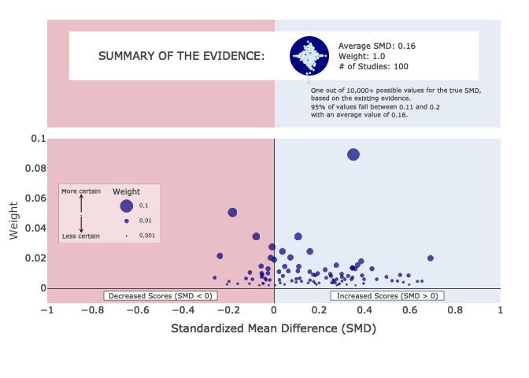

# MARCviz package

The `MARCviz` package contains the function `viz_MARC` for creating the
Meta-Analytic Rain Cloud (MARC) Plot, from [Fitzgerald & Tipton
(2022)](https://www.tandfonline.com/doi/abs/10.1080/19345747.2022.2031366).

**Note, this package is still under construction!**

To install the package, run the following code:

``` r
devtools::install_github("kgfitzgerald/MARCviz")
```

Once installed, you can load the package and pull up the help
documentation for the `viz_MARC` function.

``` r
library(MARCviz)
?viz_MARC
```

Read data:

``` r
library(tidyverse)
#read in meta-analytic dataset
data(viz_MA_data)

#specify vector of effect sizes
d_j <- viz_MA_data %>% filter(k == 100) %>% pull(d_j)
#specify vector of standard errors
se_j <- viz_MA_data %>% filter(k == 100) %>% pull(se_j)
```

Produce MARC plot (plotly - default)

``` r
#create MARC plot (default is interactive plotly object)
viz_MARC(d_j, se_j)
```

Produce MARC plot (ggplot)

``` r
#create static MARC plot (ggplot object)
viz_MARC(d_j, se_j, type = "static")
```

<!-- -->
